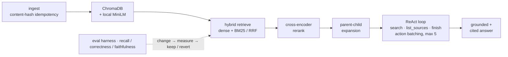

# Agentic RAG Research Assistant

A from-scratch, **eval-gated** agentic RAG system that answers complex, multi-hop
questions over an evolving document corpus — with grounded, cited answers and a
hand-rolled ReAct agent loop (later re-expressed as a LangGraph twin to prove parity).

Built learning-first: every retrieval technique had to **beat a versioned eval set or get
reverted**, and the negative results were *kept and documented*. The point isn't a chatbot —
it's the engineering discipline of treating a system that fails silently (a fluent wrong
answer looks exactly like a fluent right one) as a measured experiment.



## Headline result — each RAG knob, measured

The core experiment: take the system from a naive baseline to fully tuned **one architecture
knob at a time, with the model held constant**, re-running a fixed 43-question eval set after
each change. Same generator + judge throughout — so every delta is attributable to one knob.

| Step | Knob added | Answer correctness | Faithfulness |
| --- | --- | --- | --- |
| C0 | dense vector search (baseline) | `0.53` | `0.89` |
| C1 | + hybrid (BM25 + RRF) | `0.62` | `0.93` |
| C2 | + cross-encoder reranking | **`0.73`** | `0.95` |
| C3 | + parent-child expansion | `0.75` | `0.97` |
| C4 | + agentic ReAct loop | `0.77` | `0.97` |

**+24 points of answer correctness from architecture alone** — and the gains are uneven on
purpose: reranking did the heavy lifting, parent-child paid off in *faithfulness* not
correctness, and the agentic loop's small delta is partly an eval-coverage artifact (the set
was light on the multi-hop questions the loop is built for).

- **Answer correctness** = final answer fully matches a verified reference (LLM-judged
  CORRECT/PARTIAL/INCORRECT; only a full CORRECT counts) — end-to-end "did it answer," not
  "was the right chunk retrieved."
- **Faithfulness** = the answer stays grounded in the retrieved sources (anti-hallucination).
- The judge is a **different model family** from the generator, so nothing grades its own kin.

The full keep/revert trail behind these numbers — including the earlier recall ladder that
saturated at `1.000` after reranking and forced a deliberately harder eval set — lives in
`DESIGN_DECISIONS.md` and `docs/EXPERIMENTS.md`.

## What it looks like (multi-hop, live)

The agent reasons over what it has retrieved and decides whether to search again or answer —
this is `retrieve → reason → retrieve`, which is what lets a multi-hop question recover from a
weak first retrieval. A real run:

```
$ python -m agentic_rag.agent.loop "If embeddings were migrated to Azure AI Foundry's
  text-embedding-3-large, what dimension would the system switch to, and what new trade-offs
  would that introduce?"

agent: round 1 → SEARCH "Azure ... text-embedding-3-large embedding dimension"
        → 3 new chunk(s)
agent: round 2 → SEARCH "... embedding dimension and trade-offs"   → 1 new chunk(s)
agent: round 3 → SEARCH (repeat) → 0 new chunk(s) — oscillation guard, stop early
agent: loop done — 3 searches, 4 chunks gathered, 4 LLM calls / 5,294 tokens

A: The system would switch to 3072 dimensions [AZURE_EMBEDDING_MIGRATION_GUIDE.md].
   New trade-offs: pay-per-token pricing, internet dependency, and API rate limits
   [AZURE_EMBEDDING_MIGRATION_GUIDE.md].
```

The answer combines two facts (current 384-dim → target 3072-dim, plus the trade-offs) that
live in different documents, cites its sources, and stops itself when a search stops adding
evidence.

## Engineering practices (the actual differentiator)

- **Eval-gated change → measure → keep/revert loop.** No technique ships unmeasured. Several
  "obviously better" ideas *lost* the A/B and were reverted — and kept in the log.
- **Three eval rungs:** retrieval recall (deterministic) → answer correctness (LLM-judge) →
  faithfulness/groundedness (LLM-judge). Retrieval is scored separately from answers.
- **Kept negative results.** Recursive chunking, a reranker relevance gate, and three
  context-selection strategies all lost their A/Bs — documented, not buried (DD-017/019/023).
- **Measurement integrity.** Ungraded ≠ incorrect (a measurement you couldn't take is missing
  data, DD-016); cross-family judge to avoid self-eval bias (DD-013); "treat 1-question deltas
  as noise."
- **Hand-rolled agent loop** (`agent/loop.py`) — built by hand to learn what frameworks
  abstract: explicit tools, controller, budget, and stop conditions.
- **Per-role cost instrumentation.** Every run records token usage, split by role
  (controller / generator / judge) — cost is measured as its own axis, not narrated (DD-024).
- **Versioned prompts, config, and corpus** so any single change is A/B-testable.

## Selected design decisions

`DESIGN_DECISIONS.md` is an ADR-style log (newest first). A few worth reading:

- **DD-022** — agentic ReAct loop wins the A/B (correctness `.750→.800`, false-abstentions
  `4→0`), and a *correction*: don't infer a failure's type from its symptom — check whether
  the fact was even in context before blaming the generator.
- **DD-023** — three context-selection strategies, *all three lost*; the plain arrival-order
  budget trim stayed champion. Negative results, kept.
- **DD-019** — reranker relevance gate lost: a second-hop chunk is *legitimately*
  low-relevance, so a reranker can't tell it from a distractor. **Relevance ≠ answerhood.**
- **DD-024** — per-run token-cost instrumentation: measure cost as its own axis.

## Architecture (modules, built in order)

1. **RAG substrate** — content-hash idempotent ingestion, fixed-size chunking, hybrid
   retrieval (dense + BM25 fused by RRF), cross-encoder reranking, parent-child expansion,
   cited answers, a "not enough info" path. *(done)*
2. **Agentic layer** — hand-rolled ReAct loop: a `[search, list_sources, finish]` controller
   that can fan out independent searches in one round (action batching), a round budget, and
   oscillation/budget/empty-finish stop conditions. *(done)*
3. **Context engineering** — router-view for the controller, token-budgeted final answer;
   heavier selection strategies explored and mostly reverted (DD-023). *(explored)*
4. **Memory** — an episodic "soft cache" of past Q→A episodes, recalled across sessions and
   left for the *agent* to judge (no similarity threshold gate); validated on a sequenced
   ON-vs-OFF eval. *(done)*
5. **Harness** — logging, retries/backoff, a provider-fallback router (Gemini → Groq),
   per-role cost/latency instrumentation, a content-addressed response cache, and
   spend-cap + citation-grounding guardrails. *(done — deliberately a light pass)*

**Capstone.** The hand-rolled loop was then re-expressed as a **LangGraph** `StateGraph` and
proven to reach the same eval verdicts (24/25 identical) — built by hand first, so each
framework abstraction mapped to a piece already understood. The synthesis of what every module
taught is in `docs/RETROSPECTIVE.md`.

## How to run

> **On the corpus:** the eval set and headline numbers were produced over the author's own
> documentation, which is **not committed** — `corpus/` is gitignored for privacy. To run the
> pipeline yourself, drop your own `.md` files into `corpus/` (or point `CORPUS_ROOT` at them),
> then ingest. The committed eval set (`evals/datasets/seed.yaml`) is written against that
> private corpus, so it's here to show the **methodology and ground-truth format**, not to be
> re-run as-is against your documents.

```powershell
python -m venv .venv
.venv\Scripts\Activate.ps1
pip install -e .                 # editable install
copy .env.example .env           # then add GOOGLE_API_KEY (all LLM roles); GROQ_API_KEY optional (fallback tier)

python -m agentic_rag.rag.ingest                       # build the ChromaDB index from corpus/
python -m agentic_rag.agent.loop "your multi-hop question here"   # run the agent

# Evals (each writes a self-describing run JSON):
python -m agentic_rag.evals.retrieval            # deterministic recall / MRR
python -m agentic_rag.evals.answer_correctness   # LLM-as-judge correctness + abstention
python -m agentic_rag.evals.faithfulness         # LLM-as-judge groundedness
```

Embeddings (`all-MiniLM-L6-v2`) and the reranker run **locally on CPU** — only the
generator/judge LLMs need API keys.

## Repo orientation

| File / dir | Purpose |
| --- | --- |
| `DESIGN_DECISIONS.md` | ADR-style log of every deliberate choice + A/B result. **Start here.** |
| `docs/ProjectIdea.md` | Full project spec — the 5 modules and the eval-driven build approach. |
| `CLAUDE.md` | Working agreement; encodes the learning-first goal. |
| `docs/` | Teaching docs — general-first write-ups of chunking, reranking, evals, context. |
| `config/`, `prompts/`, `evals/datasets/` | Versioned knobs, prompts, and the eval set. |
| `src/agentic_rag/{rag,agent,context,memory,harness,llm,evals}/` | The five modules + LLM layer. |

## Honest caveats

The LLM-judge metrics are non-deterministic and several A/Bs are single runs, so
1-question deltas are noise, not signal. Where the judge shared the generator's model family
there's residual self-eval bias (it cancels within an A/B but inflates absolutes). This is a
**learning build**, not production-hardened — the limits are documented on purpose.
